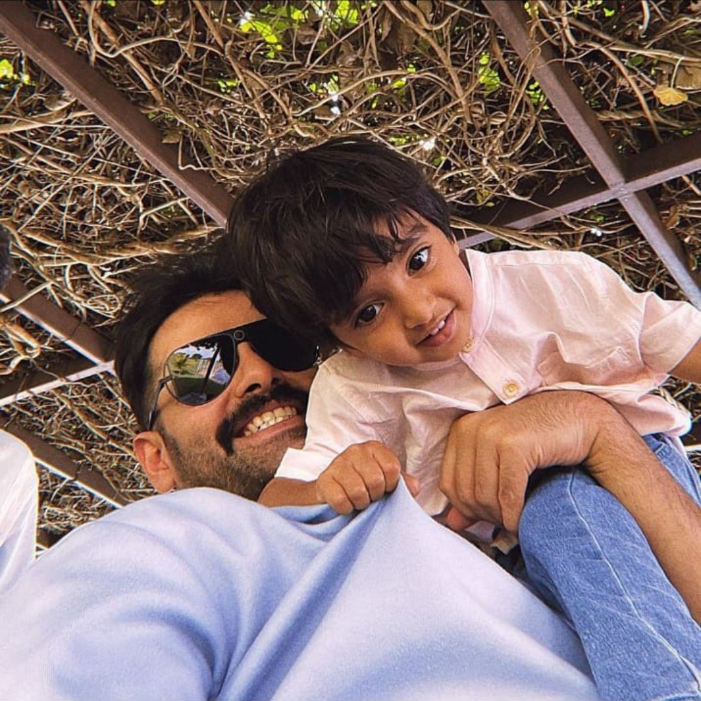

<!DOCTYPE html>
<html lang="en">
<head>
    <meta charset="UTF-8">
    <meta name="viewport" content="width=device-width, initial-scale=1.0">
    <title>Instagram clone </title>
    <link rel="preconnect" href="https://fonts.googleapis.com">
    <link rel="stylesheet" href="https://cdnjs.cloudflare.com/ajax/libs/font-awesome/6.4.2/css/all.min.css">
    <link rel="stylesheet" href="instagramclone2.css">
    
    
    
</head>
<body>

        <!-- starting nav section of instagram -->
        <nav>
            

                

                    
                

                

                    <i class="fa-solid fa-house" ></i>
                    <a href="#">Dark-mode</a>
                

                

                    <i class="fa-solid fa-magnifying-glass"></i>
                    <a href="#" >Search</a>
                

                

                    <i class="fa-regular fa-compass"></i>
                    <a href="#">Explore</a>
                

                

                    <i class="fa-solid fa-clapperboard"></i>
                    <a href="#">Reels</a>
                

                

                    <i class="fa-regular fa-message"></i>
                    <a href="#">Messages</a>
                

                

                    <i class="fa-regular fa-heart"></i>
                    <a href="#">Notification</a>
                

                

                    <i class="fa-solid fa-square-plus"></i>
                    <a href="#">Create</a>
                

                

                    

                        
                    

                    <a href="#">Profile</a>
                

                

                    <i class="fa-solid fa-bars"></i>
                    <a href="#">More</a>
                

            

            
        </nav>
        

            

                

                    

                        
                    

                   

                     <i class="fa-regular fa-heart"></i>
                     <i class="fa-regular fa-paper-plane"></i>
                   

                

                

                    

                        

                            
                        

                        Lavanya04
                    

                    

                        

                            
                        

                        Dharani100
                    

                    

                        

                            
                        

                        MR.dhanush
                    

                    

                        

                            
                        

                        Vijaya_bhaska
                    

                    

                        

                            
                        

                        Varunkumar
                    

                    

                        

                            
                        

                        Mrunalthakur
                    

                    

                        

                            
                        

                        NameisNani
                    

                    

                        

                            
                        

                        actorprabhas
                    

                

                

                    

                        

                            

                             

                                 
                             

                             

                                Mr.dhanush09

                            
                              . 1h 
                            

                            <i class="fa-solid fa-grip-lines"></i>
                         

                         

                            
                         

                         

                            

                                <i class="fa-regular fa-heart"></i>
                                <i class="fa-regular fa-message"></i>
                                <i class="fa-regular fa-paper-plane"></i>
                            

                                <i class="fa-regular fa-bookmark"></i>
                         

                         

                                
Liked by venkatalakshmi and others

                                
Mr.dhanush09 VIBES.....  more

                                
 view all comments

                         

                    

                    

                        

                            

                             

                                 
                             

                             

                                Lavanya04

                             
                              . 1d 
                            

                            <i class="fa-solid fa-grip-lines"></i>
                         

                         

                            
                         

                         

                            

                                <i class="fa-regular fa-heart"></i>
                                <i class="fa-regular fa-message"></i>
                                <i class="fa-regular fa-paper-plane"></i>
                            

                                <i class="fa-regular fa-bookmark"></i>
                         

                         

                                
Liked by Rajesh04 and others

                                

                                    Lavanya04 Self-love is the best love ,Own your magic......  more

                                
 view all comments

                         

                    

                    

                        

                            

                             

                                 
                             

                             

                                Dharani100

                            
                              . 5h 
                            

                        
                         

                         

                             
                         

                         

                            

                                <i class="fa-regular fa-heart"></i>
                                <i class="fa-regular fa-message"></i>
                                <i class="fa-regular fa-paper-plane"></i>
                            

                                <i class="fa-regular fa-bookmark"></i>
                         

                         

                                
Liked by Raghava and others

                                

                                    Dharani1000 A Day Out...  more

                                
 view all comments

                         

                    

                    

                        

                            

                             

                                 
                             

                             

                                Divyaa004

                             <i class="fa-solid fa-certificate"></i>
                              . 5d 
                            

                            <i class="fa-solid fa-grip-lines"></i>
                         

                         

                            
                         

                         

                            

                                <i class="fa-regular fa-heart"></i>
                                <i class="fa-regular fa-message"></i>
                                <i class="fa-regular fa-paper-plane"></i>
                            

                                <i class="fa-regular fa-bookmark"></i>
                         

                         

                                
Liked by Vijaya_bhaskar_reddy_22 and others

                                

                                    Divyaa004Hello peeps...  more

                                
 view all comments

                         

                    

                    

                        

                            

                             

                                 
                             

                             

                                Vijaya_bhaskar_reddy_22

                             <i class="fa-solid fa-certificate"></i>
                              . 1w 
                            

                            <i class="fa-solid fa-grip-lines"></i>
                         

                         

                            
                         

                         

                            

                                <i class="fa-regular fa-heart"></i>
                                <i class="fa-regular fa-message"></i>
                                <i class="fa-regular fa-paper-plane"></i>
                            

                                <i class="fa-regular fa-bookmark"></i>
                         

                         

                                
Liked by Divya004 and others

                                

                                    Vijaya_bhaskar_reddy_22 Recently clicked......  more

                                
 view all comments

                         

                    

                    

                        

                            

                             

                                 
                             

                             

                                Varunkumar08

                             <i class="fa-solid fa-certificate"></i>
                              . 5d 
                            

                            <i class="fa-solid fa-grip-lines"></i>
                         

                         

                            
                         

                         

                            

                                <i class="fa-regular fa-heart"></i>
                                <i class="fa-regular fa-message"></i>
                                <i class="fa-regular fa-paper-plane"></i>
                            

                                <i class="fa-regular fa-bookmark"></i>
                         

                         

                                
Liked by Hyma and others

                                

                                    Varunkumar08 Beach vibes...  more

                                
 view all comments

                         

                    

                    

                        

                            

                             

                                 
                             

                             

                                NameisNani

                             <i class="fa-solid fa-certificate"></i>
                              . 5d 
                            

                            <i class="fa-solid fa-grip-lines"></i>
                         

                         

                            
                         

                         

                            

                                <i class="fa-regular fa-heart"></i>
                                <i class="fa-regular fa-message"></i>
                                <i class="fa-regular fa-paper-plane"></i>
                            

                                <i class="fa-regular fa-bookmark"></i>
                         

                         

                                
Liked by Divyaa004 and others

                                

                                    NameisNaniHI chennai ...  more

                                
 view all comments

                         

                    

                    

                        

                            

                             

                                 
                             

                             

                                actorprabhas

                             <i class="fa-solid fa-certificate"></i>
                              . 5d 
                            

                            <i class="fa-solid fa-grip-lines"></i>
                         

                         

                            
                         

                         

                            

                                <i class="fa-regular fa-heart"></i>
                                <i class="fa-regular fa-message"></i>
                                <i class="fa-regular fa-paper-plane"></i>
                            

                                <i class="fa-regular fa-bookmark"></i>
                         

                         

                                
Liked by anushka04 and others

                                

                                    actorprabhas The Battle Begins Now...  more

                                
 view all comments

                         

                    

                    

                        

                            

                             

                                 
                             

                             

                                 Mrunalthakur

                             <i class="fa-solid fa-certificate"></i>
                              . 5d 
                            

                            <i class="fa-solid fa-grip-lines"></i>
                         

                         

                            
                         

                         

                            

                                <i class="fa-regular fa-heart"></i>
                                <i class="fa-regular fa-message"></i>
                                <i class="fa-regular fa-paper-plane"></i>
                            

                                <i class="fa-regular fa-bookmark"></i>
                         

                         

                                
Liked by dulquersalman and others

                                

                                    Mrunal ThakurMake your mark...  more

                                
 view all comments

                         

                    

                    

                        

                            

                             

                                 
                             

                             

                                urstrulymahesh

                             <i class="fa-solid fa-certificate"></i>
                              . 5d 
                            

                            <i class="fa-solid fa-grip-lines"></i>
                         

                         

                            
                         

                         

                            

                                <i class="fa-regular fa-heart"></i>
                                <i class="fa-regular fa-message"></i>
                                <i class="fa-regular fa-paper-plane"></i>
                            

                                <i class="fa-regular fa-bookmark"></i>
                         

                         

                                
Liked by namrata and others

                                

                                    urstrulymahesh With the legend...  more

                                
 view all comments

                         

                    

                    

                        

                            

                             

                                 
                             

                             

                                Viratkohli

                             <i class="fa-solid fa-certificate"></i>
                              . 5d 
                            

                            <i class="fa-solid fa-grip-lines"></i>
                         

                         

                            
                         

                         

                            

                                <i class="fa-regular fa-heart"></i>
                                <i class="fa-regular fa-message"></i>
                                <i class="fa-regular fa-paper-plane"></i>
                            

                                <i class="fa-regular fa-bookmark"></i>
                         

                         

                                
Liked by anushkasharma and others

                                

                                    Viratkohli Paris Love...  more

                                
 view all comments

                         

                    

                    

                        

                            

                             

                                 
                             

                             

                                Rampothineni

                             <i class="fa-solid fa-certificate"></i>
                              . 5d 
                            

                            <i class="fa-solid fa-grip-lines"></i>
                         

                         

                            
                         

                         

                            

                                <i class="fa-regular fa-heart"></i>
                                <i class="fa-regular fa-message"></i>
                                <i class="fa-regular fa-paper-plane"></i>
                            

                                <i class="fa-regular fa-bookmark"></i>
                         

                         

                                
Liked by kritishetty and others

                                

                                    Rampothineni Missed carrying you...  more

                                
 view all comments

                         

                    

                    

                        

                            

                             

                                 
                             

                             

                                Rohitsharma

                             <i class="fa-solid fa-certificate"></i>
                              . 5d 
                            

                            <i class="fa-solid fa-grip-lines"></i>
                         

                         

                            
                         

                         

                            

                                <i class="fa-regular fa-heart"></i>
                                <i class="fa-regular fa-message"></i>
                                <i class="fa-regular fa-paper-plane"></i>
                            

                                <i class="fa-regular fa-bookmark"></i>
                         

                         

                                
Liked by ritika and others

                                

                                    Rohitsharma finally    ...  more

                                
 view all comments

                         

                    

                

           

           

                

                    

                        

                            
                        

                        

                            
mahendrasinghdhoni

                            
dhoni07

                        

                    

                    <a href="#" class="follow">switch</a>
                

                 

                    
Suggested for you

                    <a href="#" class="see-all">see all</a>
                 

                 

                    

                        

                            
                        

                        

                            
rohit_@13

                            
Followed by shivarama77

                        

                    

                    <a href="#" class="follow">follow</a>
                

                

                    

                        

                            
                        

                        

                            
udaybhaskar

                            
Followed by vijaybhaskar_ + 2 more
                            

                        

                    

                    <a href="#" class="follow">follow</a>
                

                

                    

                        

                            
                        

                        

                            
Rajesh04

                            
Followed by Lavanya04 +....
                            

                        

                    

                    <a href="#" class="follow">follow</a>
                

                

                    

                        

                            
                        

                        

                            
dulquersalman

                            
Followed by mrunal_thakur
                            

                        

                    

                    <a href="#" class="follow">follow</a>
                

                

                    

                        

                            
                        

                        

                            
ramcharan

                            
New to Instagram

                        

                    

                    <a href="#" class="follow">follow</a>
                

                
 @All rights reserved by DIVYAJYOTHI

           

        

    
</body>
</html>
